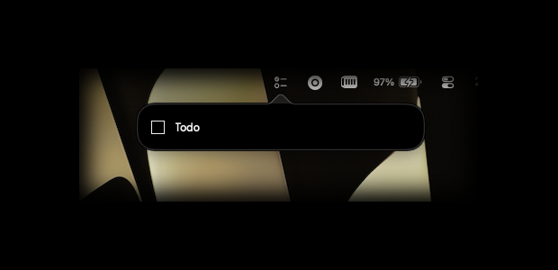
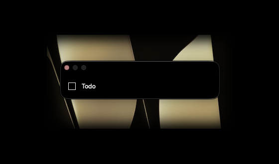

# just todo.



Enter makes a line.
Backspace takes it away.
Click the box to cross it off.

Nothing else.



### Get it

[**JustTodo.zip**](https://github.com/szymonlaskowski/justtodo/releases/latest/download/JustTodo.zip) → Applications → once, in Terminal:

```sh
xattr -dr com.apple.quarantine /Applications/JustTodo.app
```

288 KB. macOS 14. Apple Silicon and Intel. Signed ad hoc, hence the line above.

### Build it

```sh
./build.sh --install
```

Needs [bun](https://bun.sh) and `xcode-select --install`.

### All of it

```
main.swift       menu bar, popover, window, storage   273
web/src/App.tsx  the list and its two keys            154
build.sh         bun, swiftc, lipo, iconutil           61
web/src/*        the rest of the page                  80
```

One Swift file around a system web view. No Electron, no Tauri, no Xcode project, no runtime dependencies.

Your todos are plain JSON in `~/Library/Application Support/JustTodo/todos.json`. Your file.

MIT
